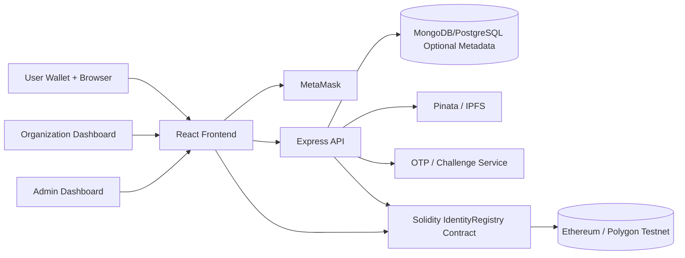
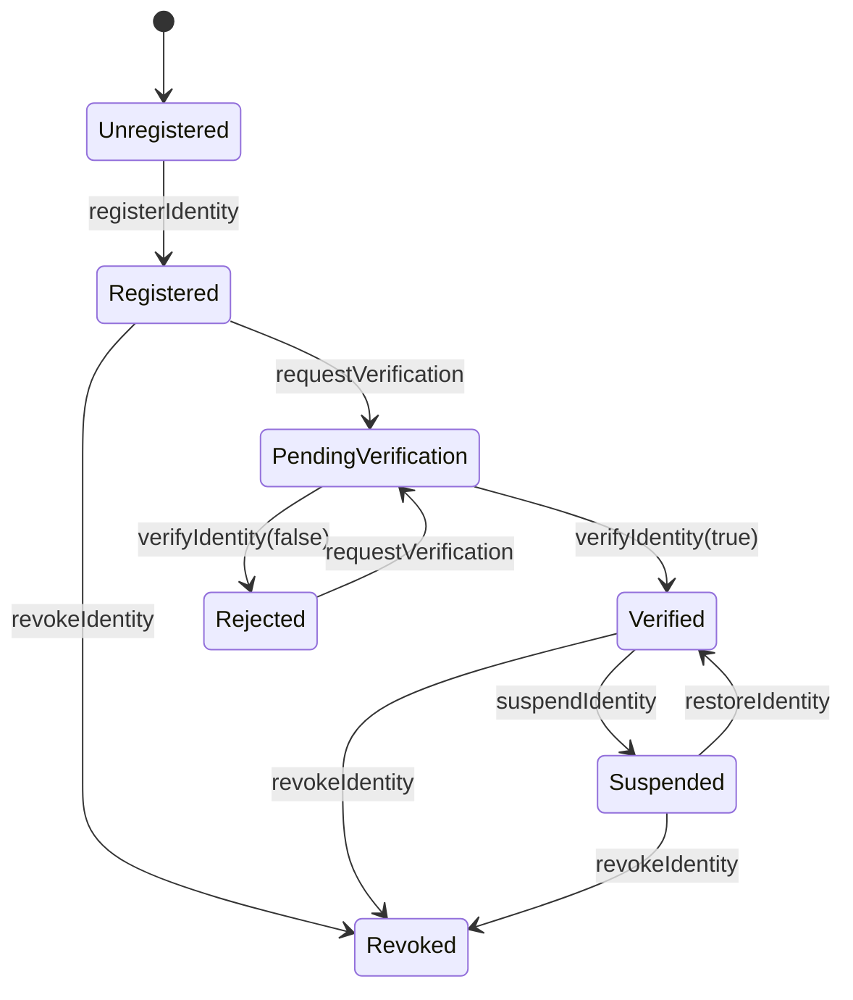
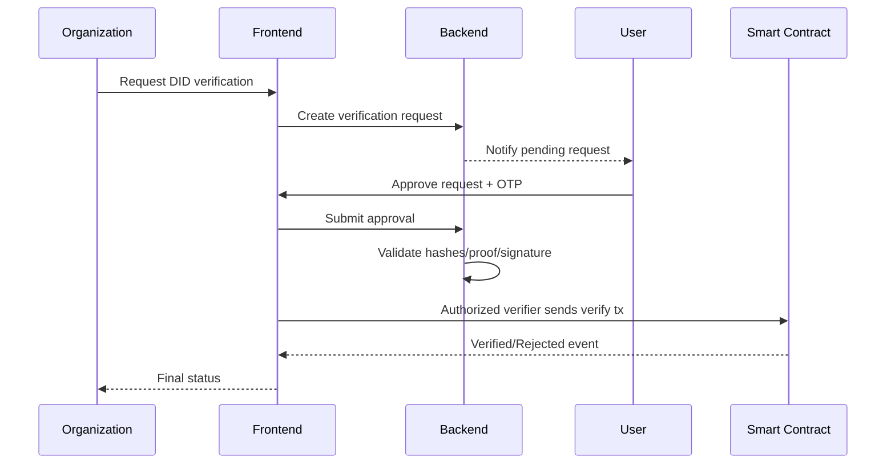

# BlockID Architecture

## High-Level Architecture

## Data Flow

1. User connects MetaMask and signs a nonce challenge.
2. Backend verifies the signature and issues a JWT.
3. User submits identity data and document files.
4. Backend encrypts sensitive metadata, hashes normalized fields, uploads encrypted payload/documents to IPFS, and returns IPFS CIDs plus proofs.
5. Frontend sends the registration transaction to the smart contract.
6. Contract stores only DID, wallet, hash pointers, timestamps, and lifecycle status.
7. Organization requests verification for a DID.
8. User approves the request and completes OTP-based step-up authentication.
9. Authorized verifier validates the proof and writes verification result on-chain.

## DID Generation Algorithm

`DID = "did:blockid:" + keccak256(walletAddress + normalizedEmail + collegeId).slice(0, 32)`

## Hashing Workflow

1. Normalize user fields.
2. Build canonical JSON payload.
3. Compute SHA-256 metadata hash.
4. Compute SHA-256 document hash for each uploaded file.
5. Build Merkle-like root by hashing concatenated metadata hash and document hashes.
6. Store only the root hash and CID references on-chain.

## Digital Signature Verification

1. Backend generates random nonce.
2. Wallet signs `BlockID authentication nonce: <nonce>`.
3. Backend recovers signer address using `ethers.verifyMessage`.
4. If recovered address matches claimed wallet address, JWT is issued.

## Smart Contract State Transitions

## Verification Sequence

